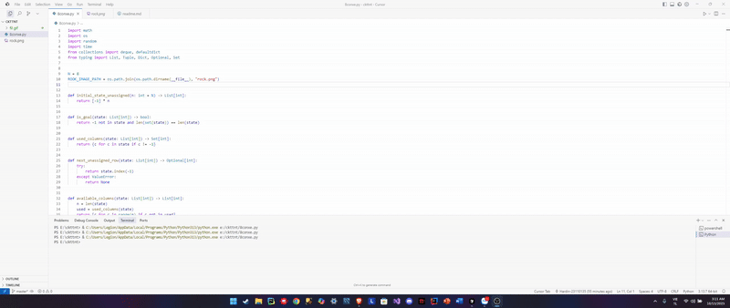
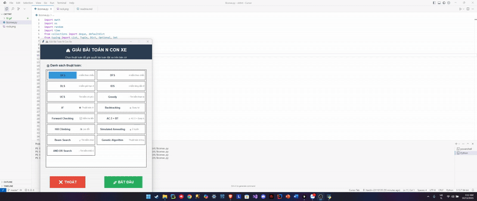
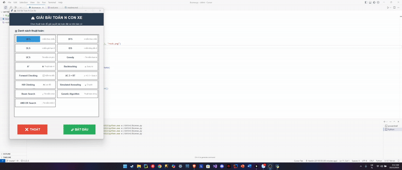
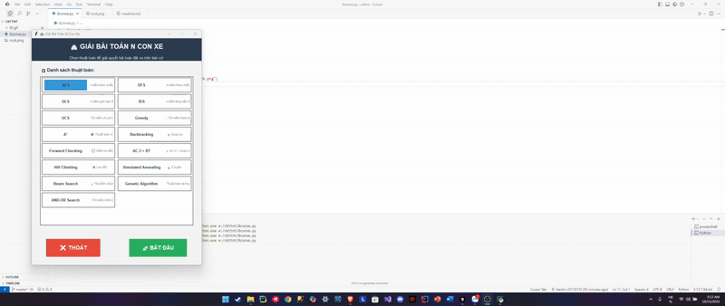
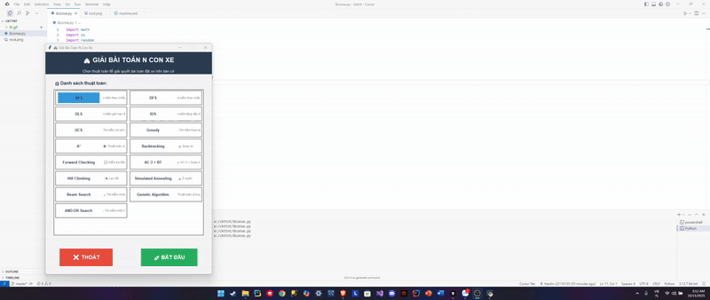
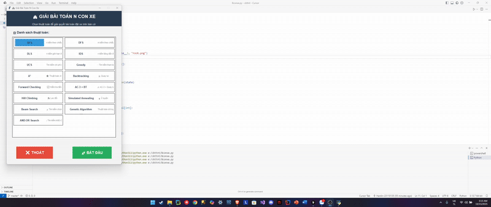

# 🎯 Bài toán N Con Xe (N-Rooks Problem)

> Đặt N con xe lên bàn cờ NxN sao cho không con nào tấn công nhau (không cùng hàng hoặc cột).

## � Giới thiệu

Đây là ứng dụng trực quan hóa **15 thuật toán AI** giải quyết bài toán N-Rooks, bao gồm:
- 🔍 **Tìm kiếm có thông tin & không có thông tin** (BFS, DFS, A*, UCS...)
- 🧩 **Thuật toán CSP** (Forward Checking, AC-3, Backtracking...)
- 🎲 **Thuật toán tối ưu cục bộ** (Hill Climbing, Simulated Annealing, Genetic Algorithm...)

## � Cài đặt & Chạy

```bash
# Cài đặt thư viện (tùy chọn - để hiển thị ảnh đẹp hơn)
pip install pillow

# Chạy ứng dụng
python 8conxe.py
```


## 🎮 HƯỚNG DẪN SỬ DỤNG CHI TIẾT

Để sử dụng ứng dụng giải bài toán N Con Xe, bạn hãy làm theo các bước sau:

### 1️⃣ Khởi động ứng dụng
- Mở terminal/cmd tại thư mục dự án.
- Chạy lệnh:
	```bash
	python 8conxe.py
	```
- Nếu muốn hiển thị quân xe đẹp hơn, hãy cài thêm thư viện Pillow:
	```bash
	pip install pillow
	```

### 2️⃣ Chọn thuật toán AI
- Khi giao diện xuất hiện, bạn sẽ thấy **menu danh sách thuật toán** ở màn hình chính.
- Mỗi thuật toán đều có mô tả ngắn gọn bên cạnh để bạn dễ lựa chọn.
- Click chọn thuật toán bạn muốn thử nghiệm (ví dụ: BFS, A*, Genetic Algorithm...).

### 3️⃣ Bắt đầu giải bài toán
- Nhấn nút **"BẮT ĐẦU"** để mở bàn cờ và giao diện trực quan hóa.
- Ứng dụng sẽ hiển thị bàn cờ NxN và các nút điều khiển bên phải.

### 4️⃣ Điều chỉnh kích thước bàn cờ (N)
- Bạn có thể thay đổi giá trị N (từ 4 đến 16) bằng cách nhập số hoặc dùng nút tăng/giảm.
- Khi thay đổi N, bàn cờ sẽ tự động cập nhật lại.

### 5️⃣ Chạy thuật toán
- Nhấn nút **"Chạy thuật toán"** để bắt đầu quá trình giải.
- Trạng thái và thời gian chạy sẽ hiển thị ở panel bên phải.
- Nếu thuật toán tìm được nghiệm hợp lệ, các quân xe sẽ xuất hiện trên bàn cờ.
- Nếu không tìm được nghiệm, trạng thái sẽ báo lỗi.

### 6️⃣ Reset và thử lại
- Nhấn nút **"Reset"** để xóa kết quả và thử lại với thuật toán hoặc giá trị N khác.

### 7️⃣ Quay lại menu
- Sử dụng nút **"Quay lại Menu"** để chọn lại thuật toán khác hoặc thoát ứng dụng.

---

### 💡 Mẹo & Lưu ý
- Nên thử nhiều thuật toán với các giá trị N khác nhau để so sánh hiệu quả.
- Một số thuật toán cục bộ (Hill Climbing, Simulated Annealing) có thể không tìm ra nghiệm với N lớn.
- Các thuật toán CSP (Forward Checking, AC-3) thường cho kết quả nhanh và chính xác.
- Nếu giao diện không hiển thị hình quân xe, hãy kiểm tra file `rock.png` và thư viện Pillow.
- Bạn có thể xem lại các demo GIF trong thư mục `gif/` để hiểu rõ hơn về từng thuật toán.

---

#### 📸 Minh họa giao diện


---

Chúc bạn học tốt và khám phá sức mạnh của các thuật toán AI!

## 🎬 Các thuật toán được cài đặt


## 🔍 TÌM KIẾM KHÔNG CÓ THÔNG TIN

| STT | Thuật toán | Mô tả | Demo |
|-----|------------|-------|------|
| 1 | **BFS (Breadth-First Search)** | Tìm kiếm theo chiều rộng, duyệt qua tất cả các trạng thái ở mỗi mức độ sâu trước khi đi sâu hơn. Đảm bảo tìm ra nghiệm nếu tồn tại, nhưng tốn nhiều bộ nhớ. |  |
| 2 | **DFS (Depth-First Search)** | Tìm kiếm theo chiều sâu, đi sâu hết một nhánh trước khi quay lui thử nhánh khác. Tiết kiệm bộ nhớ nhưng có thể không tìm ra nghiệm tối ưu. |  |
| 3 | **DLS (Depth-Limited Search)** | Giới hạn độ sâu tìm kiếm của DFS để tránh đi quá sâu vào các nhánh không có nghiệm. |  |
| 4 | **IDS (Iterative Deepening Search)** | Kết hợp ưu điểm của BFS và DFS bằng cách tăng dần độ sâu tìm kiếm. Đảm bảo tìm ra nghiệm tối ưu và tiết kiệm bộ nhớ. |  |
| 5 | **UCS (Uniform-Cost Search)** | Tìm kiếm theo chi phí đồng nhất, mở rộng theo node có chi phí thấp nhất. Trong bài toán này, chi phí mỗi bước là như nhau. |  |


## 🧠 TÌM KIẾM CÓ THÔNG TIN

| STT | Thuật toán | Mô tả | Demo |
|-----|------------|-------|------|
| 6 | **Greedy Best-First Search** | Thuật toán tham lam chọn trạng thái tiếp theo dựa trên heuristic (ước lượng) về số xung đột còn lại. Nhanh nhưng không đảm bảo tối ưu. |  |
| 7 | **A* Search** | Kết hợp chi phí thực tế (g) và ước lượng chi phí còn lại (h). Đảm bảo tìm ra nghiệm tối ưu nếu heuristic là admissible. |  |


## 🧩 THỎA MÃN RÀNG BUỘC (CSP)

| STT | Thuật toán | Mô tả | Demo |
|-----|------------|-------|------|
| 8 | **Backtracking** | Thử từng vị trí có thể cho mỗi xe, nếu không hợp lệ thì quay lui thử vị trí khác. Hiệu quả cho bài toán N con xe. |  |
| 9 | **Forward Checking** | Cải tiến của Backtracking, loại bỏ các giá trị không khả thi của các biến chưa gán ngay khi gán giá trị cho biến hiện tại. |  |
| 10 | **AC-3 + Backtracking** | Kết hợp thuật toán kiểm tra tính nhất quán hồ cung AC-3 với Backtracking để cắt tỉa không gian tìm kiếm hiệu quả hơn. |  |
| 11 | **AND-OR Search** | Phân tích bài toán thành các phần tử AND (tất cả điều kiện) và OR (một trong các điều kiện). Hiệu quả cho các bài toán có thể chia nhỏ. |  |


## 🧬 TÌM KIẾM TIẾN HÓA

| STT | Thuật toán | Mô tả | Demo |
|-----|------------|-------|------|
| 12 | **Hill Climbing** | Thuật toán tìm kiếm cục bộ, luôn chọn bước đi cải thiện trạng thái hiện tại. Có thể bị kẹt ở cực trị địa phương. |  |
| 13 | **Simulated Annealing** | Mô phỏng quá trình ủ kim loại, cho phép chấp nhận các bước đi xấu đi với xác suất giảm dần theo thời gian. Có thể thoát khỏi cực trị địa phương. |  |
| 14 | **Beam Search** | Giữ K trạng thái tốt nhất ở mỗi bước thay vì tất cả các trạng thái có thể. Cân bằng giữa tốc độ và chất lượng nghiệm. |  |
| 15 | **Genetic Algorithm** | Thuật toán di truyền, mô phỏng quá trình tiến hóa với các toán tử di truyền: chọn lọc, lai ghép, đột biến. Phù hợp cho không gian tìm kiếm lớn. |  |

## 📊 So sánh hiệu suất

| Loại | Thuật toán | Ưu điểm | Nhược điểm |
|------|-----------|---------|-----------|
| **Uninformed** | BFS | Đảm bảo tìm được lời giải | Tốn nhiều bộ nhớ |
| | DFS | Tiết kiệm bộ nhớ | Có thể đi sâu vô hạn |
| | IDS | Kết hợp ưu điểm BFS/DFS | Tính lại nhiều nút |
| **Informed** | A* | Tối ưu và đầy đủ | Cần heuristic tốt |
| | Greedy | Nhanh | Không đảm bảo tối ưu |
| **CSP** | Backtracking | Đơn giản, đảm bảo đúng | Chậm với bài toán lớn |
| | Forward Checking | Nhanh hơn backtracking | Vẫn có thể chậm |
| | AC-3 | Loại bỏ nhiều trạng thái sớm | Chi phí duy trì consistency |
| **Local** | Hill Climbing | Rất nhanh | Dễ kẹt cực trị cục bộ |
| | Simulated Annealing | Tránh cực trị cục bộ | Không đảm bảo tối ưu |
| | Genetic Algorithm | Tốt với không gian lớn | Cần điều chỉnh tham số |

## 🎯 Kết luận

- **Nhanh nhất**: Backtracking, Forward Checking (với N nhỏ)
- **Tối ưu nhất**: A*, BFS, UCS
- **Linh hoạt nhất**: Genetic Algorithm, Simulated Annealing
- **Đơn giản nhất**: DFS, Hill Climbing

## 📝 Cấu trúc thư mục

```
project/
├── 8conxe.py      # File chính chứa tất cả thuật toán
├── rock.png       # Ảnh quân xe (tùy chọn)
├── gif/           # Thư mục chứa GIF demo
│   ├── bfs.gif
│   ├── dfs.gif
│   └── ...
└── readme.md      # Tài liệu này
```

## 👨‍💻 Tác giả

**Nguyễn Hưng Nguyên**
- MSSV: 23110135
- Số điện thoại: 0983711481

Repository: [Cuoi-ki-tri-tue-nhan-tao](https://github.com/Hardin-23110135/Cuoi-ki-tri-tue-nhan-tao)

